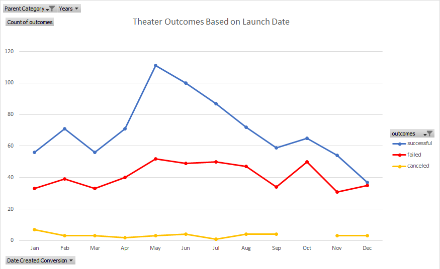

# Kickstarting with Excel

## Overview of Project
Louise is preparing the fundraising activities, and she needs to find out how different campaigns fared in relation to their launch dates and their funding goals. The data of Kickstarter is provided for analysis in Excel.

### Purpose
The purpose of this project is to understand how the outcomes of the campaign relate to the launch dates and the funding goals.

## Analysis and Challenges

### Analysis of Outcomes Based on Launch Date
The data is analyzed in an Excel workbook named "Kickstarter_Challenge" on the worksheet named "Theater Outcomes by Launch Date". The analysis result is demonstrated in the image below:

Original data and analysis is stored in the excel file below:

[Kickstarter_Challenge.xlsx](Kickstarter_Challenge.xlsx)

### Analysis of Outcomes Based on Goals
The data is analyzed in Excel workbook named "Kickstarter_Challenge" on the worksheet named "Outcomes Based on Goals". The analysis result is demonstrated in the image below:

Original data and analysis are stored in the excel file below:

[Kickstarter_Challenge.xlsx](Kickstarter_Challenge.xlsx)

### Challenges and Difficulties Encountered
It was a bit challenging to fully master the use of the VLOOKUP function in Excel. I had to Google more examples to have a better understanding.

## Results

- What are two conclusions you can draw about the Outcomes based on Launch Date?
1. From the analysis result, **May** is the best month for category theater to start as the result indicates a big spike of successful outcomes in that month.
2. The number of success starts to drop after the spike (May) and will keep the general decreasing trend till the end of the year.

- What can you conclude about the Outcomes based on Goals?

The lower goal value is more likely to have a successful outcome. The likelihood of success starts to decrease as the goal increases, but the exception occurs in the range from $35000 ~ $45000.

- What are some limitations of this dataset?

The majority of the events/data are collected from the US (73.8%), which may induce bias and inaccuracy as only a quarter of the total data come from the rest of the countries. 
  
The likelihood of success for the range $35000 ~ $45000 does not have sufficient events so the result is not statistically significant.

- What are some other possible tables and/or graphs that we could create?

A stacked column diagram can be created for "Theater Outcomes by Launch Date" to have a general idea about the percentage of success vs the percentage of failure in each month.
