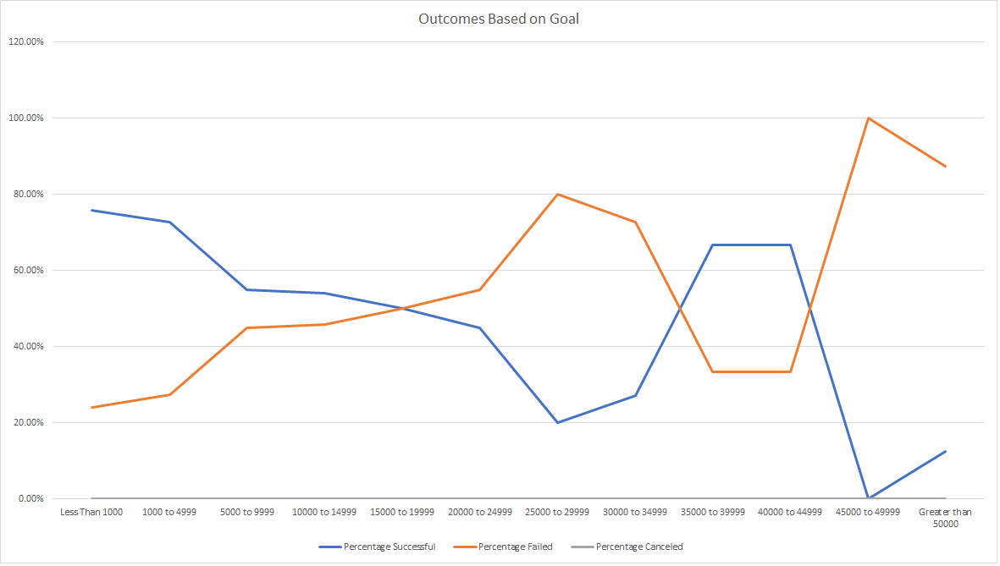

# Kickstarting with Excel

## Overview of Project
Louise is preparing the fundraising and need to find out how different campaigns fared in relation to their launch dates and their funding goals. The data of kickstarter is provided for analysis in Excel.

### Purpose
The purpose of this project is to understand how the outcomes of campaign relate to the launch dates and the funding goals.

## Analysis and Challenges

### Analysis of Outcomes Based on Launch Date
The data is analyzed in Excel workbook named "Kickstarter_Challenge" on the worksheet named "Theater Outcomes by Launch Date". The analysis result is demonstrated in the image below:

Original data and analysis is stored in the excel file below:

[filename](path/to/filename.xlxs)

### Analysis of Outcomes Based on Goals

### Challenges and Difficulties Encountered

## Results

- What are two conclusions you can draw about the Outcomes based on Launch Date?

- What can you conclude about the Outcomes based on Goals?

- What are some limitations of this dataset?

- What are some other possible tables and/or graphs that we could create?
